# QuestBasicKotlin_0252

Tugas Pertemuan 2: Basic Kotlin.
Platform: Kotlin Playground (play.kotlinlang.org)

## Hasil Running

### 1. Hello World
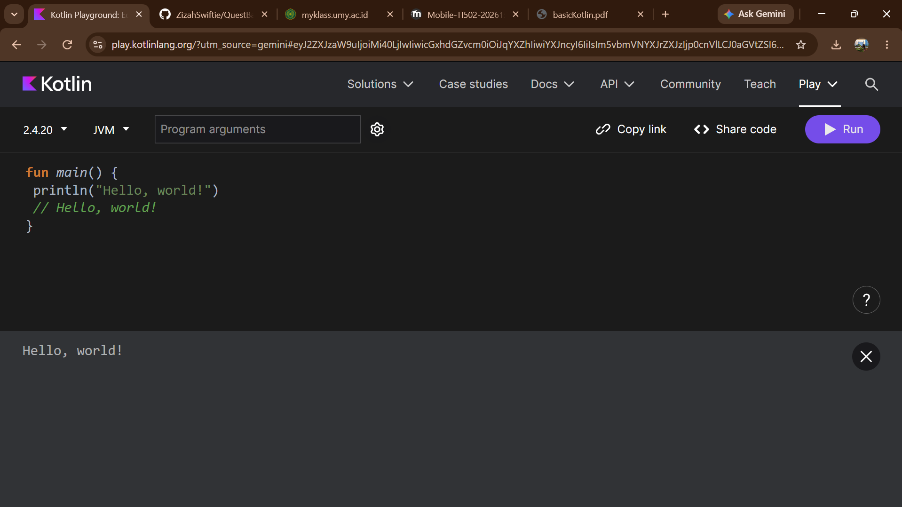

### 2. Variables
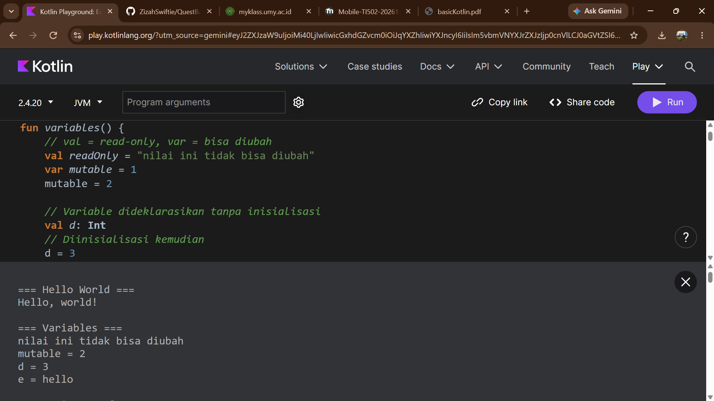

### 3. String templates
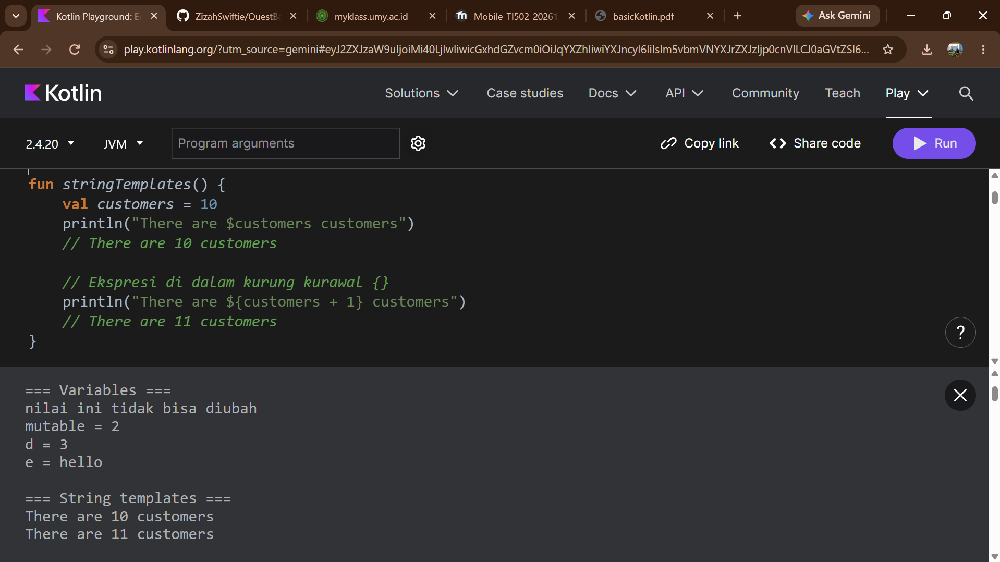

### 4. Basic types
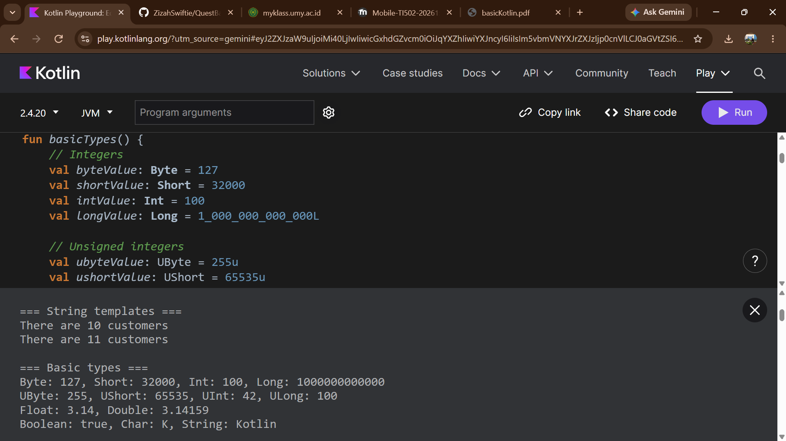

### 5. List
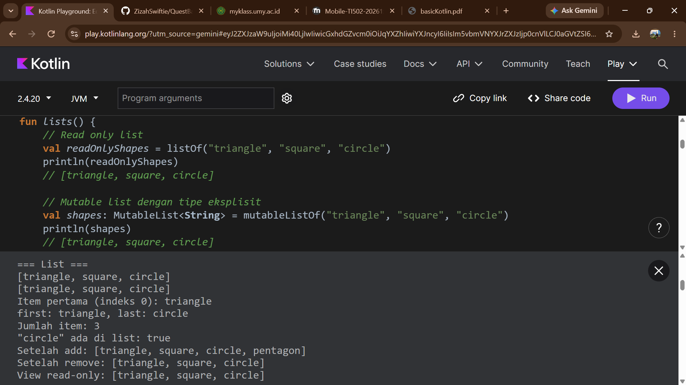

### 6. Set
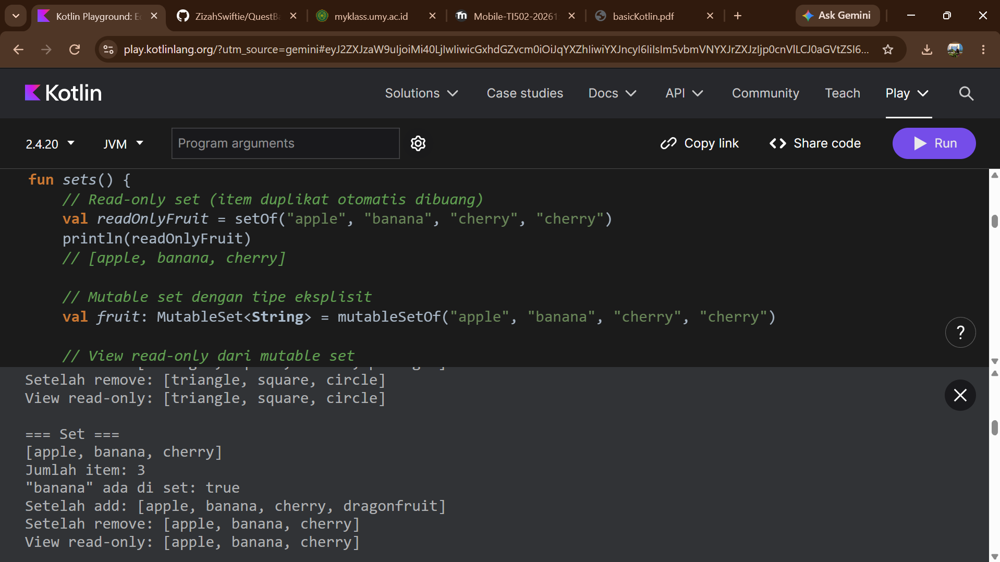

### 7. Map
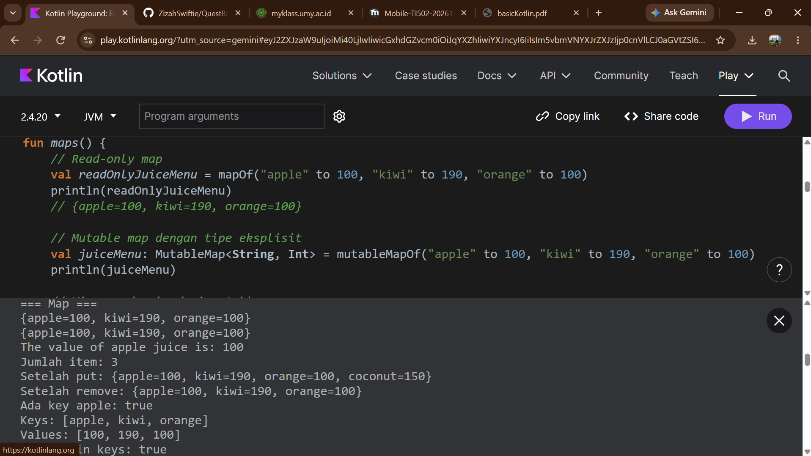

### 8. If
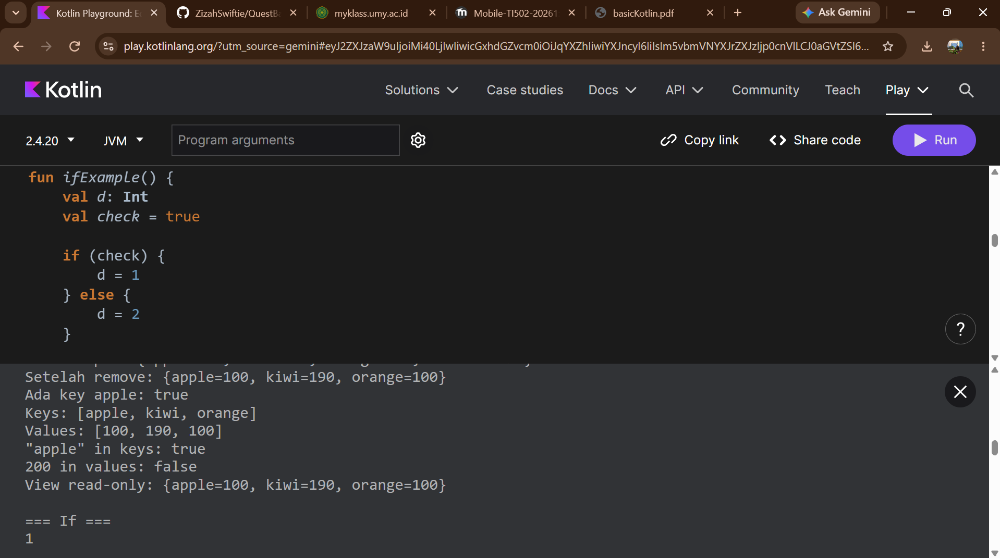

### 9. When
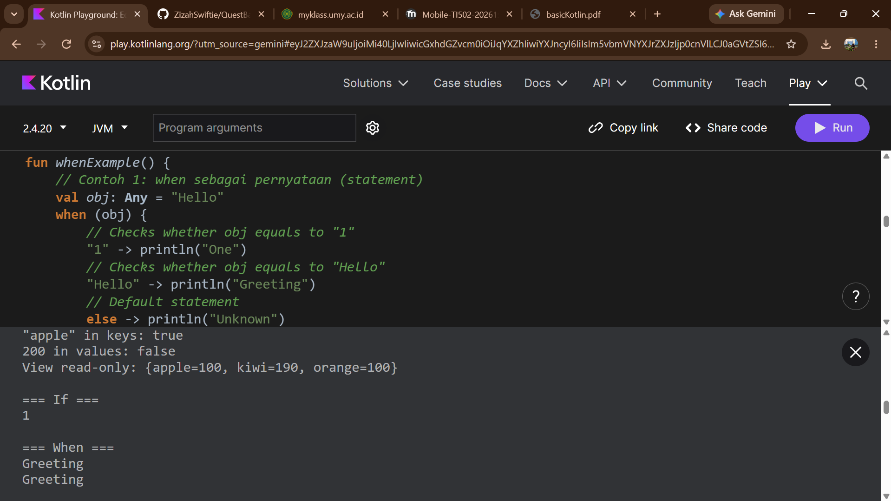

### 10. Ranges
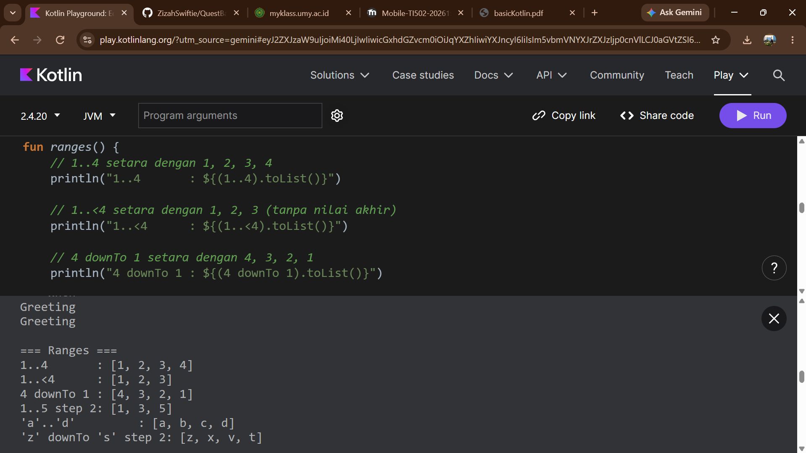

### 11. For dan While
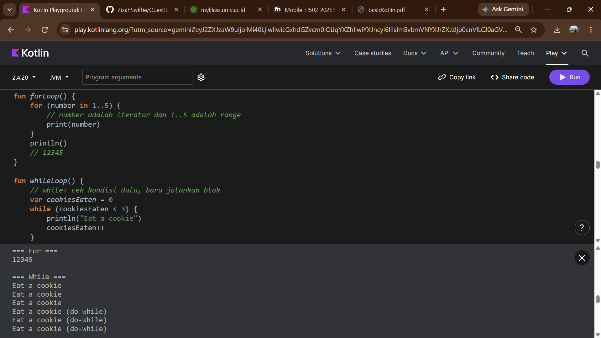

### 12. Functions
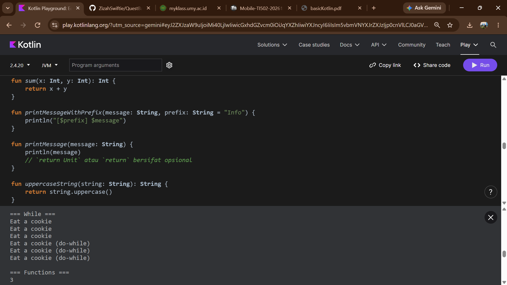

### 13. Named arguments dan Default parameter values
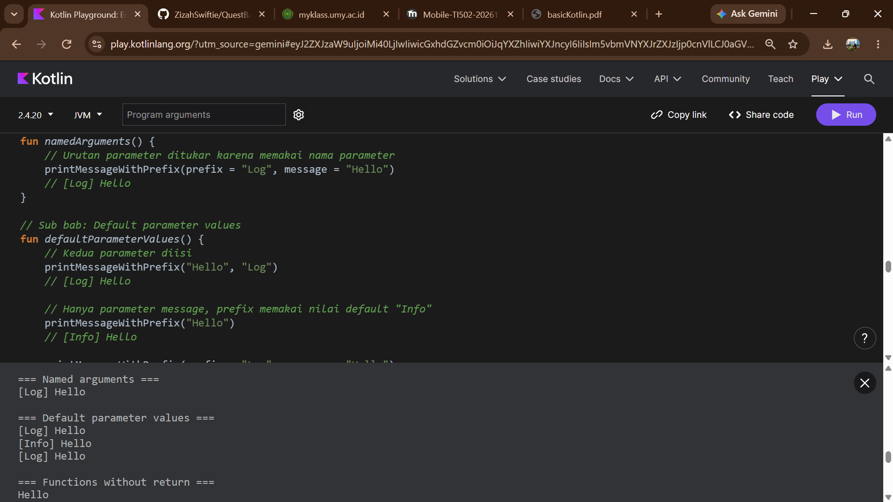

### 14. Functions without return dan Lambda expressions
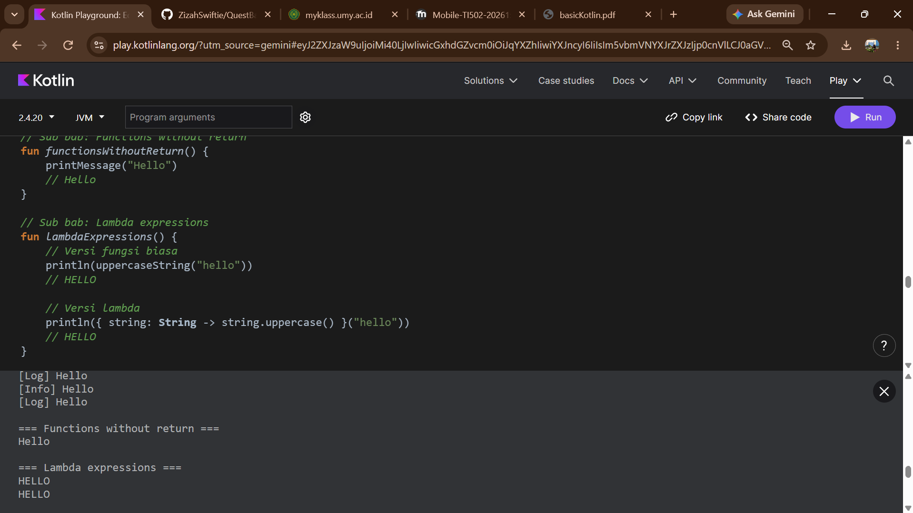

### 15. Class (Create instance dan Access properties)
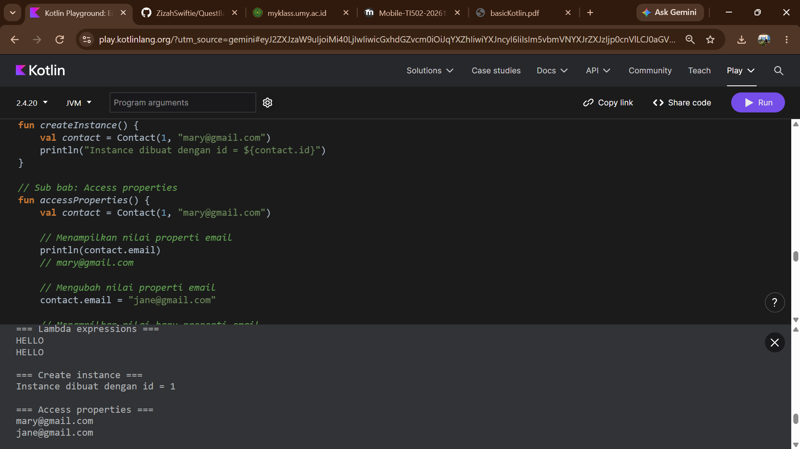

### 16. Member functions dan Data classes
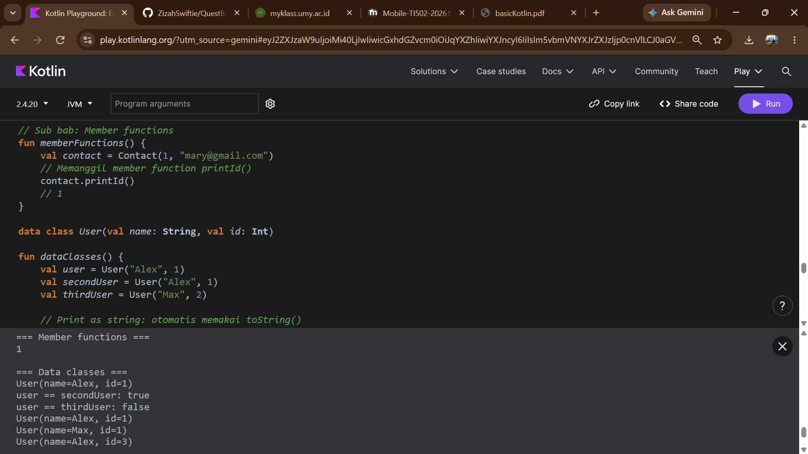

### 17. Null safety
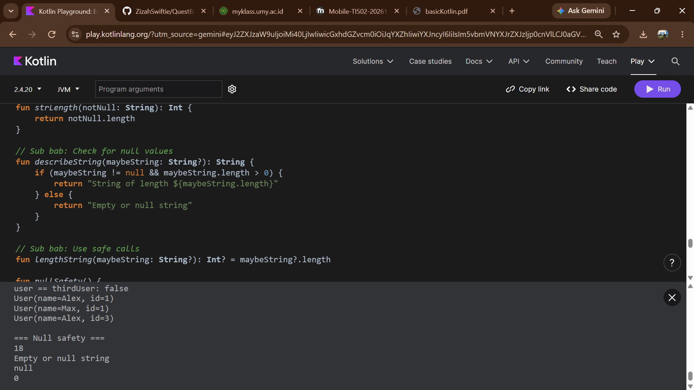
